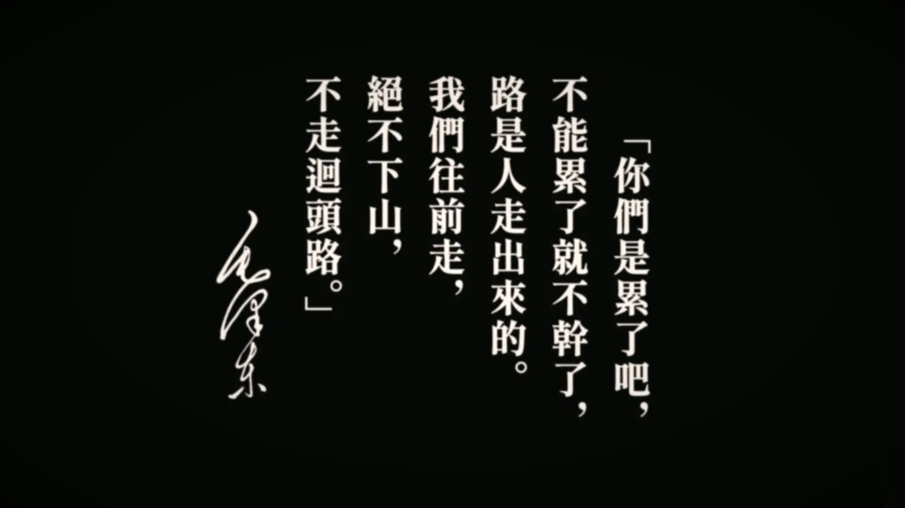

[](https://github.com/anuraghazra/github-readme-stats)

# Last Weeek Status 上周的摸鱼状态
<!--START_SECTION:waka-->

```txt
HTML         1 hr 7 mins     █████████████░░░░░░░░░░░░   51.88 %
Vue.js       26 mins         █████░░░░░░░░░░░░░░░░░░░░   20.58 %
Markdown     22 mins         ████▒░░░░░░░░░░░░░░░░░░░░   16.88 %
TypeScript   9 mins          ██░░░░░░░░░░░░░░░░░░░░░░░   07.46 %
JavaScript   3 mins          ▓░░░░░░░░░░░░░░░░░░░░░░░░   03.01 %
```

<!--END_SECTION:waka-->

---

#### 人类距离共产主义真正实现的那一天，还有很长的路要走。这条路太长了，或许我们在座的每个人都不可能见到它出现的那一天，这一点，我们的孩辈们也是同样的。为一个理想，几十代人前赴后继，这是人类历史的摇滚朋克，是将被记录在史书上的浪漫主义。

#### There is still a long way to go for us human beings before we can build up a completely communist world.
#### The way is too long that all of us at this moment are not able to see it comes up.
#### And this is the same for our child as well.
#### However, for an ultimate goal that generations dedicate themselves to building, this is bound to be named as a rock and roll in the history of mankind, and will be called as romanticism by those late-comers.


